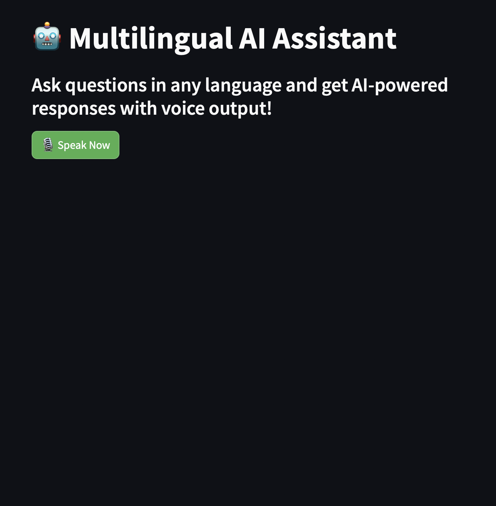
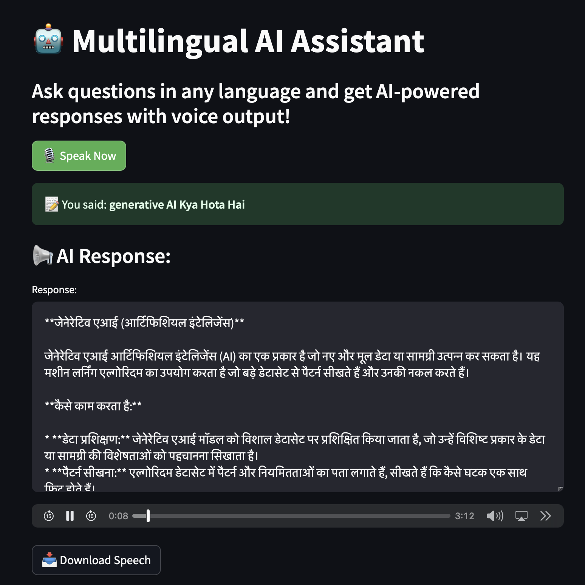

# 🌍🎙️ Multilingual AI Assistant 🤖  

<div style="display: flex; justify-content: center; gap: 20px;">
    
    
</div>

## **Table of Contents**  
- [📌 Introduction](#-introduction)  
- [🚀 Problem Statement](#-problem-statement)  
- [💡 Features](#-features)  
- [⚙️ How It Works](#-how-it-works)  
- [🛠️ Tech Stack](#-tech-stack)  
- [📌 Installation & Setup](#-installation--setup)  
 

---

## 📌 **Introduction**  
The **Multilingual AI Assistant** is an intelligent voice-powered chatbot that allows users to interact using **speech and text** in multiple languages. This AI assistant can **understand, process, and respond** naturally through both **text and audio output**, making it ideal for a wide range of applications like customer support, accessibility tools, and education.  

---

## 🚀 **Problem Statement**  
With the rise of AI assistants like **Google Assistant, Alexa, and Siri**, many applications still lack **multilingual and real-time conversational capabilities**.  
🔴 **Existing Challenges:**  
- Most AI assistants **lack real-time speech processing** in multiple languages.  
- Limited support for **interactive voice responses** and **human-like conversation flow**.  
- Many solutions are **not optimized for accessibility**, making it hard for non-text users to interact.  
- Need for **lightweight, open-source alternatives** that work with **custom AI models**.  

✅ **Our Solution:**  
- **AI-driven multilingual speech processing** for seamless voice interaction.  
- **Speech-to-Text (STT) + AI Response + Text-to-Speech (TTS)** in one system.  
- **Supports multiple languages**, making it **globally accessible**.  
- **User-friendly interface** for an intuitive experience.  

---

## 💡 **Features**  
✔️ **Real-time Speech Recognition** – Converts voice input into text instantly.  
✔️ **AI-Powered Chatbot** – Uses Google Gemini Pro to generate intelligent responses.  
✔️ **Multilingual Support** – Communicates in multiple languages dynamically.  
✔️ **Text-to-Speech (TTS)** – Converts AI responses into speech for natural interactions.  
✔️ **Interactive UI** – Buttons for "Start Listening, and response display.  
✔️ **Downloadable Audio Responses** – Users can save AI-generated speech.  

---

## ⚙️ **How It Works**  
1️⃣ **Click "Start Listening"** – The system begins recording your voice.  
2️⃣ AI **transcribes your speech** into text.  
3️⃣ AI **processes the input** and generates a relevant response.  
4️⃣ **Response displayed as text and played as speech.**  
5️⃣ Users can **download the AI-generated speech**.  
6️⃣ Click **"Stop Listening"** to end the session.  

---

## 🛠️ **Tech Stack**  
- **Programming Language:** Python 🐍  
- **Frontend:** Streamlit 🎨  
- **Backend AI Model:** Google Gemini Pro (LLM)  
- **Speech Processing:** Google Speech-to-Text (STT) & Google Text-to-Speech (TTS)  
- **Libraries:**  SpeechRecognition, gTTS  

---

## 📌 **Installation & Setup**  

### 🔧 **Requirements**  
- Python 3.10+  
- Google API Key (for Gemini Pro & Speech APIs)  
- Dependencies installed  

### 🛠️ **Installation Steps**  
```bash
# Clone the repository
git clone https://github.com/your-repo/multilingual-ai-assistant.git  
cd multilingual-ai-assistant  

# Create and activate a virtual environment (optional but recommended)
python -m venv venv  
source venv/bin/activate  # On macOS/Linux  
venv\Scripts\activate  # On Windows  

# Install dependencies
pip install -r requirements.txt  

# Run the application
streamlit run app.py  # For Streamlit  
